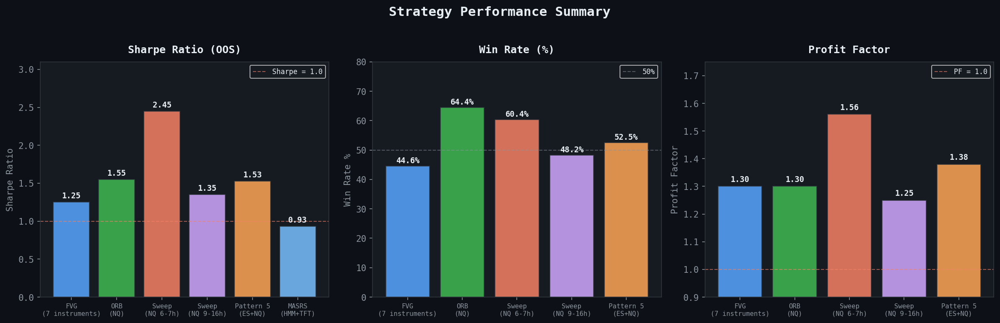
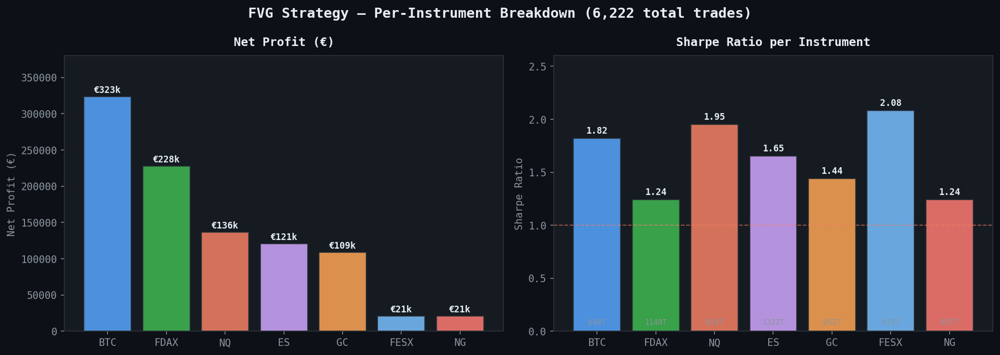
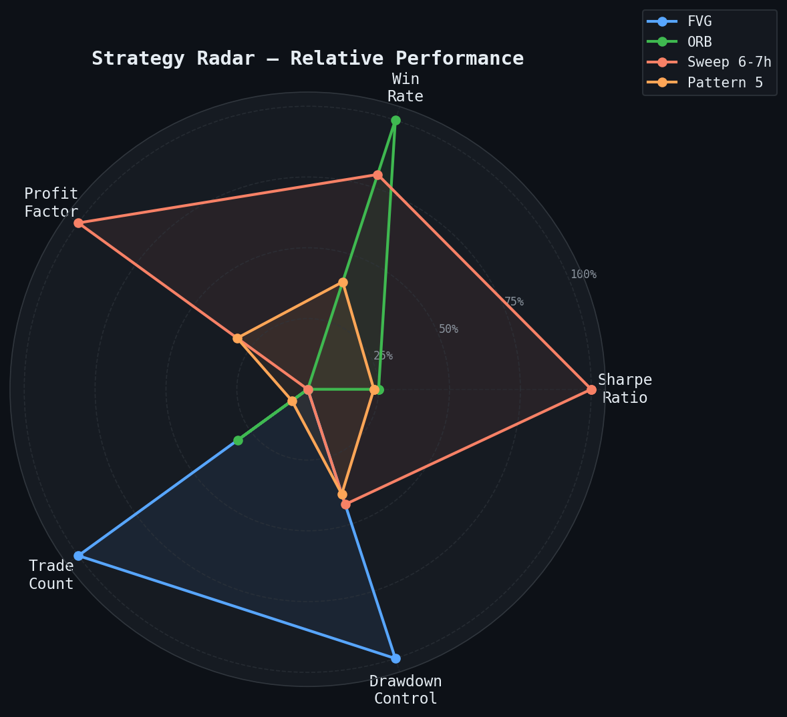
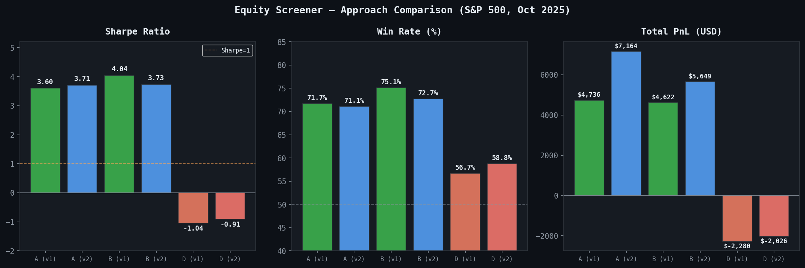

# Quantitative Research & Algorithmic Trading

**Romano Raffaele** · MSc Data Science, Università degli Studi di Milano-Bicocca (Oct 2026)  
romano.raff10@gmail.com · Milano, Italy · [github.com/raff1031/quantitative-research](https://github.com/raff1031/quantitative-research)

---

Personal research and trading projects built from scratch between 2024 and 2026. The work covers futures and crypto systematic strategies, market making, stat-arb, and ML signal generation. Everything here was built, tested, and iterated on independently — not coursework.

Out-of-sample validation is standard across all projects. Look-ahead bias is handled with purged/embargoed cross-validation or a fixed train/test split where all parameters are locked on training data before touching the test period.

---

## Results

| Strategy | Instruments | Trades | Sharpe | Win Rate | Profit Factor | Max DD |
|----------|-------------|--------|--------|----------|---------------|--------|
| FVG | BTC, ES, NQ, FDAX, FESX, GC, NG | 6,222 | 1.25 | 44.6% | 1.30 | -4.9% |
| ORB | NQ | 923 | 1.55 | 64.4% | 1.30 | -33.2% |
| Sweep Retracement | NQ (6–7h) | 399 | **2.45** | **60.4%** | 1.56 | -21.1% |
| Sweep Retracement | NQ (9–16h) | 693 | 1.35 | 48.2% | 1.25 | -20.8% |
| Pattern 5 | ES, NQ | 482 | 1.53 | 52.5% | 1.38 | -22.2% |
| MASRS (HMM + TFT) | BTC/ETH Perps | walk-fwd OOS | 0.93 | — | — | -13.4% |

All results net of transaction costs. FVG/ORB/Sweep/Pattern 5 from NinjaTrader 8 trade exports. MASRS is walk-forward OOS on Binance/Bybit live data.

---

## FVG — Per-Instrument

| Instrument | Trades | Net Profit | Avg Trade | Sharpe | Win Rate |
|------------|--------|------------|-----------|--------|----------|
| BTC | 648 | €323,209 | €498.8 | 1.82 | 40.7% |
| FDAX | 1,140 | €227,832 | €199.9 | 1.24 | 50.2% |
| NQ | 824 | €136,075 | €165.1 | 1.95 | 43.1% |
| ES | 1,322 | €120,721 | €91.3 | 1.65 | 32.7% |
| GC | 952 | €108,724 | €114.2 | 1.44 | 52.0% |
| FESX | 479 | €20,689 | €43.2 | 2.08 | 55.9% |
| NG | 857 | €20,535 | €23.96 | 1.24 | 45.6% |

---

## Projects

### 1. Avellaneda-Stoikov Market Maker
`Market Making AS/as_anti_adverse_selection.py`

Hummingbot V2 script implementing the AS (2008) stochastic control framework. The core model handles reservation price and optimal spread from inventory risk γ, volatility σ, and order arrival κ. On top of that I added four layers to handle adverse flow:

- EMA trend filter with quote skewing when momentum is directional
- OBI (order book imbalance) — pulls quotes when bid/ask depth ratio signals incoming pressure
- Kill-switch — pauses everything when ATR spikes above threshold
- Inventory hard limits

Runs live on Hummingbot against Binance/Bybit spot and perps.

---

### 2. Pairs Trading v5
`Market Making AS/pairs_trading_v5.py`

Five iterations. The table below shows what broke in each version and why — I kept it in because the failures are more informative than the final result:

| Version | What went wrong | Result |
|---------|-----------------|--------|
| v1 | KO/PEP not actually cointegrated | Losses |
| v3 | Only 2 trades generated | Not meaningful |
| v4 | Cross-sector pairs, no economic logic | 609 trades, -12.5% |
| v5 | Intra-sector only, calibrated OOS | Profitable OOS |

v5 uses Engle-Granger on intra-sector pairs only, 60/40 train/test with all parameters frozen after training, Kalman filter hedge ratio (δ=1e-5), log-price spread. Entry at z>1.5, exit at z=0, stop at z>3.5, 5bps TC.

---

### 3. Autoencoder Stat-Arb
`Market Making AS/AE smart beta/autoencoder_statarb_v2.py`

A sparse autoencoder trained on 5 years of S&P 500 daily returns learns a compressed latent space. The residuals between input and reconstruction are mean-reverting by construction and used as trading signals.

Architecture is encoder → 8-dim bottleneck → decoder. Signal is per-stock residual z-score vs. a rolling 60-day window. Each signal is decomposed back into latent dimensions to understand what's driving it. There's also a smart beta version that applies the same logic to factor portfolios.

---

### 4. LSTM Screener
`screener v2/`

Bidirectional LSTM on weekly OHLCV + 10 features (RSI-14, MACD, Bollinger Band position, volume ratio, ATR range, ADX, 1/2/4-week returns). Features use `.shift(1)` throughout — no leakage.

Walk-forward validation: 80% rolling train, 20% OOS, 12-week embargo between folds. Position sizing scales with model confidence. 10bps TC.

Tested on AAPL, GOOG, AMZN, NFLX, MRNA, GC=F, BTC-USD. Training ran on RTX 4050 (6.4GB VRAM).

> Note: a self-audit (`screener v2/AUDIT_REPORT.md`) found a lookahead bias in the position sizing — `np.std(predictions)` was computed over the full test set instead of the validation set. The bug and the fix are documented. I left it in because finding it matters more than hiding it.

---

### 5. Cross-Asset Signal Model v3
`co-correlazione/model_v3.py`

Signal stack for biotech/pharma (IBB, MRNA, LLY) with five layers:

1. GARCH-filtered returns fed into a Gaussian HMM — 3-state regime (bull / bear / high-vol)
2. Gradient Boosting classifier with PCA compression and isotonic calibration
3. Live options chain: P/C ratio, ATM-IV, IV skew, term structure slope
4. News sentiment via VADER on yfinance.news headlines (no API key needed)
5. VIX/VVIX as external regime conditioning

Final signal is the product of all five layers. Interactive Plotly dashboard included.

---

### 6. FVG Strategy
`FVG csv/FVG.ipynb`

ICT Fair Value Gap setups backtested systematically across BTC, ES, NQ, FDAX, FESX, GC, NG. Gaps identified from OHLC bars, entry on retest, exit at next imbalance or time stop. 6,222 trades total, Sharpe 1.25. Best single instrument by Sharpe is NQ (1.95), best by average trade is BTC (€498.8/trade).

---

### 7. Open Range Breakout
`csv orb/orb.ipynb`

ORB on NQ 5-minute bars. Opening range is the first N bars after RTH open; entry on confirmed close outside range with BB confirmation. 923 trades, Sharpe 1.55, 64.4% win rate. Includes parameter grid with correlation analysis to check robustness across configurations.

---

### 8. Sweep Retracement (NinjaTrader 8 / C#)
`NT8 strat/HourSweepRetracement.cs`

NinjaTrader 8 strategy in C# that detects hourly liquidity sweeps (stops taken above/below prior hour high/low) and enters on retracement back inside the range. Best configuration on NQ: Sharpe 2.45, win rate 60.4%, profit factor 1.56. Both long-bias and inverse variants in the repo.

---

### 9. Equity Screener — Approach Comparison
`backtest_results/`

Three approaches tested on S&P 500 universe (103 tickers, Oct 2025):

| Approach | Trades | Win Rate | Sharpe | PnL |
|----------|--------|----------|--------|-----|
| A (v2) | 662 | 71.1% | 3.71 | $7,164 |
| B (v2) | 501 | 72.7% | 3.73 | $5,649 |
| D (v2) | 1,744 | 58.8% | -0.91 | -$2,026 |

Approach D is a negative result — high trade frequency with short holding periods destroys signal. Kept in deliberately.

---

### 10. FCF Screener
`FCF.ipynb` · `screener v2/screener.py`

S&P 500 ranking by FCF yield and growth consistency. Monthly rebalancing, 120-stock portfolio. Portfolio123-compatible output format.

---

### 11. XGBoost Market Model (v72 series)
`tutor-ai/`

Multi-asset signal model across AAPL, GOOG, TSLA, MRNA, LLY, ETH-USD, SOL-USD and Nasdaq futures. The model stack combines GARCH-filtered returns, a 3-state Gaussian HMM for regime detection, fractionally differenced price series (d=0.5), Google Trends z-scores, transformer-based news sentiment, and XGBoost with RandomizedSearchCV tuning. Features are always lagged by one period; the OOS window is 6 months with 12 months validation and 10-day purge gaps between folds.

The version history is tracked in `DIFFERENZE_V2.1_V2.2.md` — includes what changed between iterations and why. Signal generation, portfolio sizing, and live execution are split into separate scripts (`generate_signals.py`, `equity_optimizer.py`, `run_pipeline.py`) to keep each piece testable independently.

CGBoost variants (`cgboost v80.py`, `cgboost v82.py`) explore custom boosting with regime-conditional objectives. Two smoketests check that no forward-looking data leaks into the feature set.

---

### 12. Sector Stat-Arb Suite
`tutor-ai/stat_arb_biotech.py` · `stat_arb_commodity.py` · `stat_arb_macro.py` · `stat_arb_tech_momentum.py`

Four stat-arb modules each targeting a different market segment:

- **Biotech**: pairs within IBB/XBI constituents, cointegration-screened, sized by FDA event calendar
- **Commodity**: spreads across energy, metals, and ag ETFs; mean-reversion on seasonally adjusted spreads
- **Macro**: relative value across rates, currencies, and equity indices using correlated macro pairs
- **Tech Momentum**: cross-sectional momentum with mean-reversion overlay on semiconductor/cloud pairs

All four share the same spread construction (log-price, Kalman hedge ratio) and entry/exit logic (z-score thresholds, hard stop). Live signal output feeds into the main portfolio manager.

---

### 13. IBKR Live Execution
`tutor-ai/tws_executor.py`

Live and paper trading via IB Gateway on ports 4001/4002. The executor handles order routing, position tracking, fill confirmation, and emergency exits. Receives signals from `generate_signals.py` and executes sized orders without manual intervention. Supports dry-run mode for pre-trade validation before going live. Integrates with `pnl_tracker.py` for real-time P&L logging and `mega_portfolio.py` for multi-strategy position consolidation. Full pipeline runs via `run_pipeline.py`, which chains signal generation, dry-run, optional live execution, and logs each run to `auto_run_history.csv`.

---

### 14. TradingAgents — Multi-Agent LLM Framework
`quant-ai/tradingagents/`

Extension of the open-source TradingAgents framework (TauricResearch/TradingAgents, arxiv:2412.20138). The framework decomposes trading decisions across specialized LLM agents: fundamental analyst, sentiment analyst, news analyst, technical analyst, bull/bear researcher debate, trader, and portfolio manager with risk gating.

The local extension adds a quarterly backtest pipeline (`quarterly_pipeline/`) tested on a megacap universe 2018–2025, a point-in-time feature pipeline (`feature_pipeline/`) that reconstructs realistic signal availability dates, a VWAP trend backtest (`vwap_trend_backtest.py`), a stat-arb pairs module (`statarb_pairs_backtest.py`), and a WRDS PEAD research scaffold (`wrds_pead_revisions_scaffold.py`).

The PEAD scaffold is designed for strict point-in-time integrity: signal availability is keyed to IBES filing dates rather than report period end, with an IBES-CRSP link for permno resolution and optional Compustat Point-in-Time enrichment. The spec documents the full dataset stack (IBES detail history, actuals, adjustment factors, CRSP daily) and the design constraints.

---

## Stack

| | |
|--|--|
| Languages | Python 3.10, C# (.NET / NinjaTrader 8) |
| ML | PyTorch (CUDA), scikit-learn, XGBoost, hmmlearn, transformers |
| LLM agents | TradingAgents (LangGraph, OpenAI/Anthropic/Gemini backends) |
| Market making | Hummingbot ScriptStrategyBase V2 |
| Data | yfinance, Binance/Bybit WebSocket, NinjaTrader feed, IBKR TWS, WRDS/IBES |
| Execution | Hummingbot, NinjaTrader 8, IBKR TWS (live + paper), custom asyncio engine |
| Backtesting | Custom walk-forward, purged/embargoed CV, quarterly pipeline (2018–2025) |
| Viz | Matplotlib, Plotly, HTML dashboards |
| Quant | statsmodels, arch, scipy, vaderSentiment, pytrends |

---

All results are net of transaction costs and validated out-of-sample. Past performance doesn't guarantee future results.
